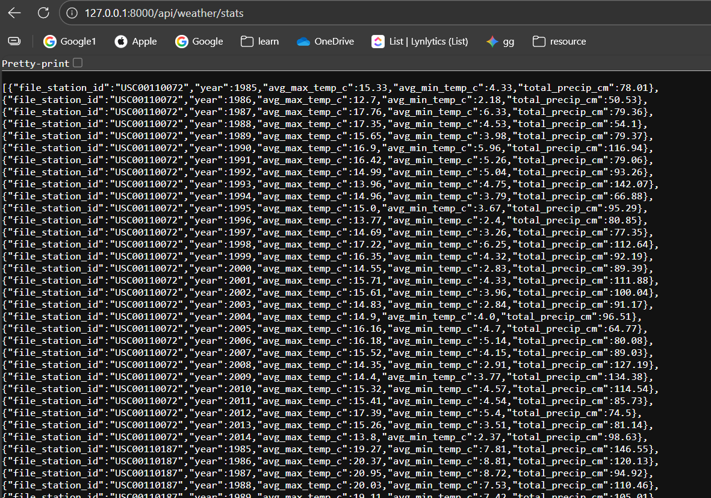

# Weather Data Pipeline & API

This project is a robust data engineering pipeline designed to ingest historical weather data, store it in a relational database, perform analytical aggregations, and expose the results via a REST API.

It has been structured as a Python package to ensure modularity, scalability, and ease of maintenance.

## Key Features

* **Automated Ingestion:** A production-ready script (`scripts/ingest.py`) streams data directly from the source (GitHub API) into the database without needing local file storage.
* **Data Analysis:** An optimized analysis script (`scripts/analysis.py`) performs yearly aggregations (Average Temp, Total Precipitation) using SQL for efficiency.
* **REST API:** A FastAPI application provides access to both raw records and calculated statistics, featuring pagination, filtering, and automatic documentation.
* **Configuration Management:** All settings (Database URLs, API endpoints) are managed via environment variables in `app/config.py`, following 12-Factor App methodology.

## Project Structure

```text
corteva_weather/
├── app/                  # Core Application Logic
│   ├── config.py         # Centralized configuration (Env vars)
│   ├── datamodel.py      # SQLAlchemy Database Models (Tables)
│   └── __init__.py       # Package marker
├── scripts/              # Executable Pipeline Tasks
│   ├── ingest.py         # Data Ingestion Job
│   ├── analysis.py       # Data Analysis Job
│   └── __init__.py       # Package marker
├── app.py                # API Application Entrypoint
├── requirements.txt      # Python dependencies
└── README.md             # Project Documentation 
```

## Setup & Installation
1. Prerequisites
> Python 3.9 or higher

Git

2. Installation
Clone the repository and install the required dependencies:

Bash

> git clone <repository_url>
> cd corteva_weather
> pip install -r requirements.txt
Usage Guide
To populate the database and start the server, run the following commands in order.

## Step 1: Ingest Data
This script connects to the GitHub API, downloads weather data files, checks for duplicates, and inserts them into the database.

Note: We use python -m to run the script as a module.

*Bash

> python -m scripts.ingest

## Step 2: Run Analysis
This script calculates the yearly statistics (Average Max/Min Temp, Total Precipitation) for all ingested stations.

*Bash

> python -m scripts.analysis
## Step 3: Start the API Server
This launches the web server locally.

Bash

>  uvicorn app:app --reload

## API Documentation
Once the server is running, you can access the interactive Swagger UI documentation at: 👉 http://127.0.0.1:8000/docs

Available Endpoints
GET /api/weather: Retrieve raw daily weather records.

Filters: station_id, date

GET /api/weather/stats: Retrieve calculated yearly summaries.

Filters: station_id, year

**

**
